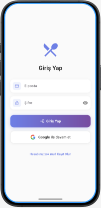
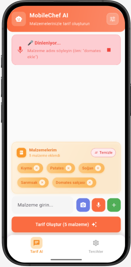
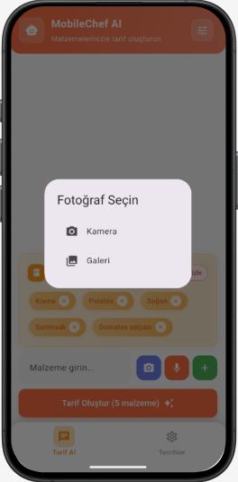
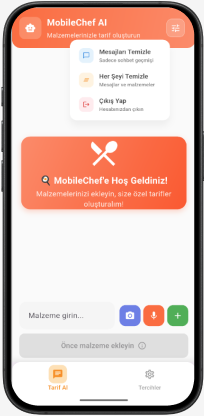
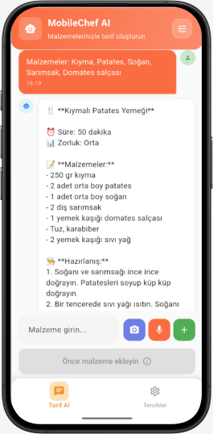
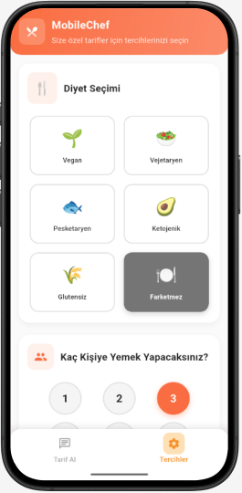
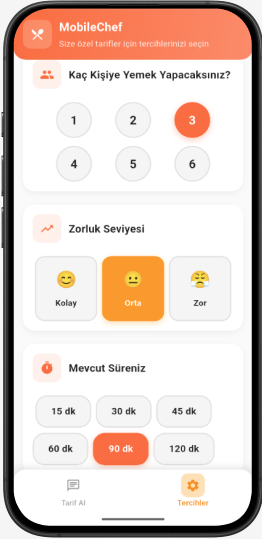
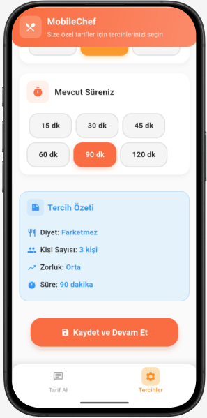

# MobileChef AI 🍳🤖

MobileChef AI, kullanıcıların ellerindeki malzemelere göre **akıllı tarifler** oluşturabilen bir mobil uygulamadır. Hem yazılı hem de görsel (fotoğraf tabanlı) malzeme girişi ile çalışır ve kullanıcıların tercihlerine göre özelleştirilebilir tarifler sunar.

---

## Öne Çıkan Özellikler

| Özellik | Açıklama | Görsel |
|---------|---------|--------|
| **Kayıt olma ve Giriş Yapma Ekranı** | Kullanıcı, Hesap oluşturup giriş yapabilir. |  |
| **Malzeme Bazlı Tarif** | Kullanıcı, Malzemelerini ekleyerek tarif oluşturabilir. |  |
| **Sesli Malzeme Girişi** | Kullanıcı, Mikrofon ile malzemeleri ekleyebilir. |  |
| **Fotoğraf ile Malzeme Tespiti** | Kullanıcı, Fotoğraf yükleyip malzemeleri otomatik ekleyebilir. |  |
| **Chat Kontrol Menüsü** | Kullanıcı, sohbetteki mesajları veya tüm ekranı temizleyebilir. Ayrıca çıkış yapabilir |  |
| **AI Tarif Önerisi** | Gemini 2.0 Flash API ile tarifler oluşturulur. |  |
| **Diyet Tercihi** | Kullanıcı, spesifik olarak bir diyet yapıyorsa bu tercihlerden birini yapabilir. |  |
| **Kullanıcı Tercihleri** | Kişi Sayısı, tarif zorluğu ve pişirme süresi tercihleri. |  |
| **Tercihleri Kaydetme** | Kullanıcı tercihlerini bir kez kaydettikten sonra tüm tercihler firestoreda tutulur ve tarif oluşturulurken gemini'ye gönderilir. |  |

---

## Teknolojiler ve Araçlar

- **Flutter & Dart** – Mobil uygulama geliştirme
- **MVVM (Model-View-ViewModel)** – Uygulama mimarisi ve state management yapısı
- **Provider** – State management (ViewModel yapısı)
- **Firebase Authentication** – Kullanıcı girişi ve kaydı
- **Cloud Firestore** – Kullanıcı tercihleri ve veri yönetimi
- **Gemini 2.0 Flash Lite API** – AI tabanlı tarif önerisi ve fotoğraf analizi
- **OpenFoodFacts API** – Malzeme doğrulama
- **Speech_to_Text & Permission_Handler** – Sesle malzeme girişi
- **HTTP ve JSON** – API çağrıları ve veri işleme
- **Responsive UI** – Farklı ekran boyutlarına uyum

---

### Katmanlar

- **Services**: `authService`, `firestoreService`, `geminiService`, `openFoodFactsService`, `speechService`, `ingredientParser`
- **ViewModel**: `chatViewModel`, `loginViewModel`, `preferViewModel`
- **Model**: `apiResponseModel`, `preferenceModel`, `userModel`
- **Repository**: `repository.dart`, `preferenceRepository`
- **UI / Views**: `chatPage`, `loginPage`, `preferPage`, `components`, `appColors`, `responsive`
- **constants**: `appConstants`, `ingredientDictionary`
- **assets**: `ingredients.json`
---

## Uygulama Akışı

    1. Kullanıcı kayıt olur veya giriş yapar.
    2. Kullanıcının ilk girişi ise varsayılan değerler kullanılır.
    3. Önceden tercih kaydı yapmış ise tercihler Firestore'dan çekilir.
    4. Kullanıcı malzemeleri ekler:
    - Yazı veya ses ile
    - Fotoğraf ile otomatik tanıma ile
    5. Tarif Oluştur butonuna basıldığında AI’dan tarif alınır.
    6. Tarifi sohbet arayüzünde görüntüler.

---